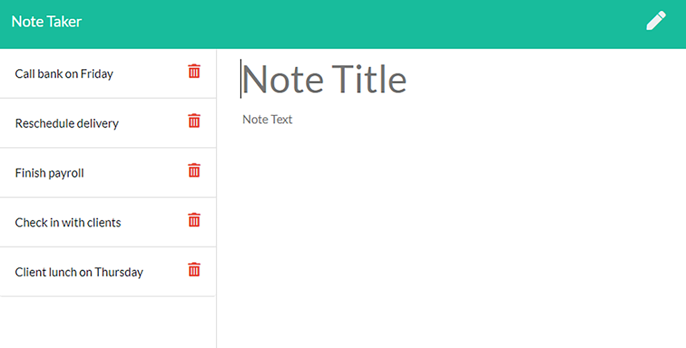

# Note Taker


## Description

The main purpose of this project is to create a tool for writing and saving notes. This tool is helpful especially for small business owners who want to keep track of tasks they need to complete.

## Table of Contents
* [Description](#description)
* [Table of Contents](#table-of-contents)
* [Usage](#usage)
* [License](#license)
* [Contributing](#contributing)
* [Screenshots](#screenshots)
* [Live-URL](#Live-URL)
* [Questions](#questions)

## Usage
Please first install node.js and then run the following commands into your terminal: 

```
git clone <from-repository-on-github>
npm install
npm start

```
## License
Please see the following link for license information: 
[GitHub-license](./utils/license-MIT.txt)

## Contributing
Please first submit a new issue for the change you want to make in this repository on GitHub. Then, git clone the repo and do the changes locally on your machine. When you are done with your changes, create a pull request on the GitHub repository.

## Screenshots
Please see below for the snapshots of two pages of note taker app:

* Main Page


* Notes Page




## Live-URL
Here is the live url of deployed application:
[Live URL](https://notetaker-ss-041621.herokuapp.com/)

## Questions
If you have any questions please use the following two links to contact me:

* [GitHub](https://github.com/sshahram)

* [Email Address](mailto:shirin.shahram23@gmail.com)
